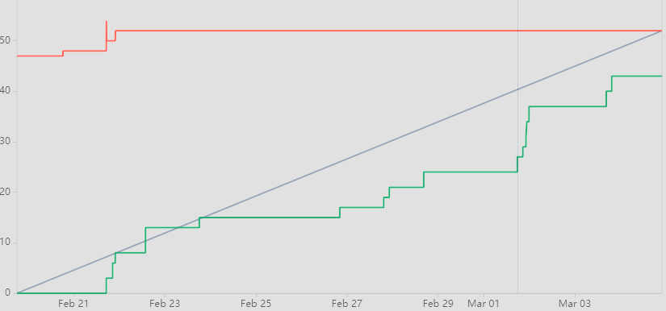
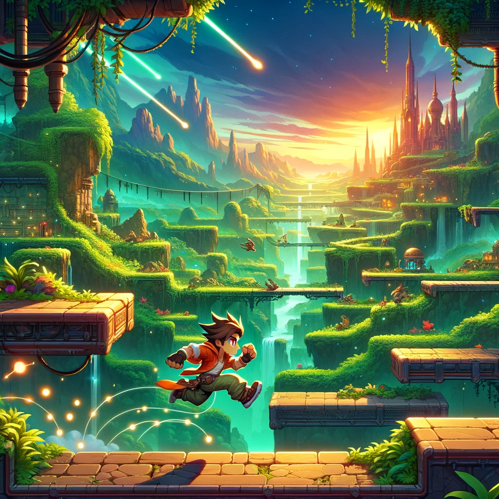
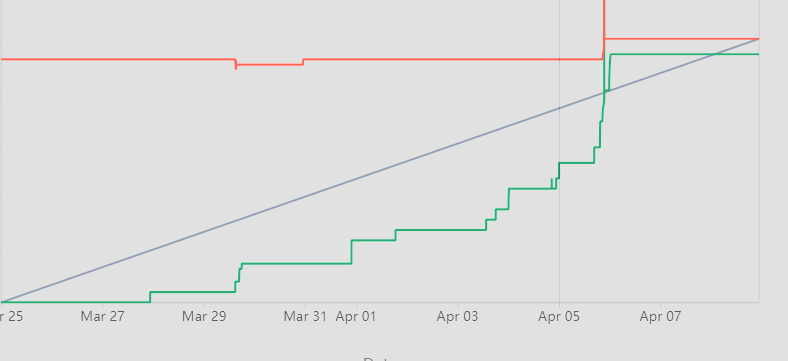

# Project Mayhem
> Outline a brief description of your project.
> Live demo [_here_](https://www.example.com). <!-- If you have the project hosted somewhere, include the link here. -->

## Table of Contents
* [General Info](#general-information)
* [Technologies Used](#technologies-used)
* [Features](#features)
* [Screenshots](#screenshots)
* [Setup](#setup)
* [Usage](#usage)
* [Project Status](#project-status)
* [Room for Improvement](#room-for-improvement)
* [Acknowledgements](#acknowledgements)
* [Contact](#contact)
<!-- * [License](#license) -->

## General Information
- Team Members:
- Blake Woods
- Mustafa Chambers
- Seth Leifheit
- Fernando Martinez
- Abel Guzman

- For this project we are creating a 2D side-scrolling video game using the Python library, Pygame.
- We are creating this game for people who enjoy retro style video games like Mario.
- Our team chose to make a side-scroller for its classic appeal, embracing the challenge of innovating within a beloved genre, fueled by our imagination and our passion for gaming.

## Technologies Used
- Programming Language - Python
- Python Library - Pygame
- IDE - VSCode
- Repository - Bitbucket

## Features

## Sprint 1

Blake: " Provided users with mob movement, game window, background , and health bar on mobs".

- Task 1: Create simple movement for level one mobs.

[SCRUM45](https://cs3398s24mimas.atlassian.net/jira/software/projects/SCRUM/boards/1?isInsightsOpen=true&selectedIssue=SCRUM-45) 

[bitbucket](https://bitbucket.org/cs3398s24mimas/2d-side-scroller/commits/067dac8d694ce3e5de855b6dc0da55a23b8362ed)

- Task 2: Set up window for the game and set up a window for level 1

[SCRUM60](https://cs3398s24mimas.atlassian.net/jira/software/projects/SCRUM/boards/1?isInsightsOpen=true&selectedIssue=SCRUM-60) 

[bitbucket](https://bitbucket.org/cs3398s24mimas/2d-side-scroller/commits/e53617b7c99be1afafaa92c0090298d9e942298d)

- Task 3: Create the background for level one in pygame

[SRUM30](https://cs3398s24mimas.atlassian.net/jira/software/projects/SCRUM/boards/1?isInsightsOpen=true&selectedIssue=SCRUM-30)

[bitbucket](https://bitbucket.org/cs3398s24mimas/2d-side-scroller/commits/283bcbdf764ff7b83ac1cddfba113f5271daccba)

- Task 4: Create a boundary at the end of the level

[SCRUM61](https://cs3398s24mimas.atlassian.net/jira/software/projects/SCRUM/boards/1?isInsightsOpen=true&selectedIssue=SCRUM-61)

[bitbucket](https://bitbucket.org/cs3398s24mimas/2d-side-scroller/commits/6d895960d2cf53620d8a114625b703ee72da4e5a)

- Task 5: Add a health bar to mobs

[SCRUM46](https://cs3398s24mimas.atlassian.net/jira/software/projects/SCRUM/boards/1?isInsightsOpen=true&selectedIssue=SCRUM-46)

[bitbucket](https://bitbucket.org/cs3398s24mimas/2d-side-scroller/commits/579e940e544bf6cc9b7843de4adfad1f62281a0b)

Freddy: " Provided users with title screen and loading screen ".

- Task 1: Implement title screen interface

[SCRUM25](https://cs3398s24mimas.atlassian.net/jira/software/projects/SCRUM/boards/1?selectedIssue=SCRUM-25)

[bitbucket](https://bitbucket.org/cs3398s24mimas/2d-side-scroller/commits/74e3e9ca6a30056b47cb8336ddd7850c54986462)

- Task 2: Create a loading Screen

[SCRUM35](https://cs3398s24mimas.atlassian.net/jira/software/projects/SCRUM/boards/1?selectedIssue=SCRUM-35)

[bitbucket](https://bitbucket.org/cs3398s24mimas/2d-side-scroller/commits/74e3e9ca6a30056b47cb8336ddd7850c54986462)

Seth: " Provided users with sound of the characeter and simple movement character ".

- Task 1: Create the sound of the character

[SCRUM54](https://cs3398s24mimas.atlassian.net/jira/software/projects/SCRUM/boards/1?selectedIssue=SCRUM-54)

[bitbucket](https://bitbucket.org/cs3398s24mimas/2d-side-scroller/commits/ef4b9872bc8776490d45d0330902cc1d20b5751f)

- Task 2: Create simple movement in the character

[SCRUM32](https://cs3398s24mimas.atlassian.net/jira/software/projects/SCRUM/boards/1?selectedIssue=SCRUM-32)

[bitbucket](https://bitbucket.org/cs3398s24mimas/2d-side-scroller/commits/3844024fd2ac73d0770f2c0a9304b41c3b0fb68a)

Abel: " Provided user with character design, music track, level one mobs, and level one boss ".

- Task 1 Create one character design with different color swaps.

[SCRUM38](https://cs3398s24mimas.atlassian.net/jira/software/projects/SCRUM/boards/1?selectedIssue=SCRUM-38)

[bitbucket](https://bitbucket.org/cs3398s24mimas/2d-side-scroller/commits/b253fca970a7cccd8c51b9db2690acae984e87dc)

- Task 2 Create a music track for the game

[SCRUM36](https://cs3398s24mimas.atlassian.net/jira/software/projects/SCRUM/boards/1?selectedIssue=SCRUM-36)

[bitbucket](https://bitbucket.org/cs3398s24mimas/2d-side-scroller/commits/efaa1ead1142ba37d38c4de7fc6916980359d1e8)

- Task 3 Start designing level one mobs

[SCRUM43](https://cs3398s24mimas.atlassian.net/jira/software/projects/SCRUM/boards/1?selectedIssue=SCRUM-43)

[bitbucket](https://bitbucket.org/cs3398s24mimas/2d-side-scroller/commits/f9014b5c5dbb001ea0e8eeac227316322579124e)

- Task 4 Start designing level one boss

[SCRUM44](https://cs3398s24mimas.atlassian.net/jira/software/projects/SCRUM/boards/1?selectedIssue=SCRUM-44)

[bitbucket](https://bitbucket.org/cs3398s24mimas/2d-side-scroller/commits/64d4dacf8fd8ce86455a76852b4790032c812b04)

Mustafa: " Provided user with tex box, character backstory, sound of the level one mobs, and sound of the level boss ".

- Task 1 Create a text box

[SCRUM41](https://cs3398s24mimas.atlassian.net/jira/software/projects/SCRUM/boards/1?selectedIssue=SCRUM-41)

[bitbucket](https://bitbucket.org/cs3398s24mimas/2d-side-scroller/commits/e865780881896d36c6eef889f0a5cfacfc3f821f)

- Task 2 Create the character backstory

[SCRUM53](https://cs3398s24mimas.atlassian.net/jira/software/projects/SCRUM/boards/1?selectedIssue=SCRUM-53)

[bitbucket](https://bitbucket.org/cs3398s24mimas/2d-side-scroller/commits/717c92a455da27f36ab0b589ca15866c5bf80a43)

- Task 3 Create the sound of the level one mobs

[SCRUM55](https://cs3398s24mimas.atlassian.net/jira/software/projects/SCRUM/boards/1?selectedIssue=SCRUM-55)

[bitbucket](https://bitbucket.org/cs3398s24mimas/2d-side-scroller/commits/8b2140b03a1c911b0333db340904de7fb974b1ec)

- Task 4 Create the sound of the level boss

[SCRUM56](https://cs3398s24mimas.atlassian.net/jira/software/projects/SCRUM/boards/1?selectedIssue=SCRUM-56)

[bitbucket](https://bitbucket.org/cs3398s24mimas/2d-side-scroller/commits/4d8c8b2def9bc3c7386b1182091de20f6a69cb0a)

## Jira Report

## Screenshots

<!-- If you have screenshots you'd like to share, include them here. -->

## Setup
What are the project requirements/dependencies? Where are they listed? A requirements.txt or a Pipfile.lock file perhaps? Where is it located?

Proceed to describe how to install / setup one's local environment / get started with the project.

## Usage
How does one go about using it?
Provide various use cases and code examples here.

`write-your-code-here`

## Project Status
Project is: _in progress_ / _complete_ / _no longer being worked on_. If you are no longer working on it, provide reasons why.

## Room for Improvement
Include areas you believe need improvement / could be improved. Also add TODOs for future development.

Room for improvement:

To do:

- Title Screen - The initial interface offering options to start a new game or load a saved one, catering to all player types. Aj User Story 1 

- Choice a Player - This is where the user will choice a player that is male or female. Blake User Story 4 
- Platform - Create a platform for the character sprite to stand on. Seth User Story 3 
- Movement - Create a simple movement in the character (left and right). Freddy User Story 1 
- Background - Create a background in Godot that moves relative to player movement. Seth User Story 3 

## Acknowledgements
Give credit here.
- This project was inspired by...
- This project was based on [this tutorial](https://www.example.com).
- Many thanks to...

## Contact
Created by [@flynerdpl](https://www.flynerd.pl/) - feel free to contact me!

<!-- Optional -->
<!-- ## License -->
<!-- This project is open source and available under the [... License](). -->

<!-- You don't have to include all sections - just the one's relevant to your project -->

## Sprint 2

Blake Woods:

- Task 1: Make the background parallax scrolling

[Scrum70](https://cs3398s24mimas.atlassian.net/jira/software/projects/SCRUM/boards/1?selectedIssue=SCRUM-70)

[bitbucket](https://bitbucket.org/cs3398s24mimas/2d-side-scroller/commits/e44baa0609553f21fa2dbcddd5b2491b2f843936)

[Pull Request](https://bitbucket.org/cs3398s24mimas/%7B0e32a28c-8195-43b6-a28f-473a74bb774f%7D/pull-requests/2)
- Task 2: Fix the mob spawning bug

[SCRUM66](https://cs3398s24mimas.atlassian.net/jira/software/projects/SCRUM/boards/1?selectedIssue=SCRUM-66)

[bitbucket](https://bitbucket.org/cs3398s24mimas/2d-side-scroller/commits/417698cf84189ca3742ef1d6c97aa1f117d468dd)

[Pull Request](https://bitbucket.org/cs3398s24mimas/%7B0e32a28c-8195-43b6-a28f-473a74bb774f%7D/pull-requests/3)

- Task 3: Clean of the repo so it looks nice

[SCRUM88](https://cs3398s24mimas.atlassian.net/jira/software/projects/SCRUM/boards/1?selectedIssue=SCRUM-88)

[Pull Request](https://bitbucket.org/cs3398s24mimas/%7B0e32a28c-8195-43b6-a28f-473a74bb774f%7D/pull-requests/4)

[bitbucket](https://bitbucket.org/cs3398s24mimas/2d-side-scroller/commits/fa5c16d5d76de27322f62534814c470137004a11)

- Task 4: Add the boss into the game

[SCRUM67](https://cs3398s24mimas.atlassian.net/jira/software/projects/SCRUM/boards/1?selectedIssue=SCRUM-67)

[bitbucket](https://bitbucket.org/cs3398s24mimas/2d-side-scroller/commits/5c3182e2f7eed10c022072e966289b6322d58687)

[Pull Request](https://bitbucket.org/cs3398s24mimas/%7B0e32a28c-8195-43b6-a28f-473a74bb774f%7D/pull-requests/7)

- Task 5: Add movement to the boss

[SCRUM68](https://cs3398s24mimas.atlassian.net/jira/software/projects/SCRUM/boards/1?selectedIssue=SCRUM-68)

[bitbucket](https://bitbucket.org/cs3398s24mimas/2d-side-scroller/commits/9f560045411b0c820a46ddad0744c152f4d68efb)

[Pull request](https://bitbucket.org/cs3398s24mimas/%7B0e32a28c-8195-43b6-a28f-473a74bb774f%7D/pull-requests/8)

- Task 6: Add a health bar to the boss

[SCRUM69](https://cs3398s24mimas.atlassian.net/jira/software/projects/SCRUM/boards/1?selectedIssue=SCRUM-69)

[bitbucket](https://bitbucket.org/cs3398s24mimas/2d-side-scroller/commits/b10710c291e4125a731940ede65f92b6c8a9f65b)

[Pull Request](https://cs3398s24mimas.atlassian.net/jira/software/projects/SCRUM/boards/1?selectedIssue=SCRUM-69)

Abel Guzman:

- Task 1: Create the moving animations for the character

[SCRUM73](https://cs3398s24mimas.atlassian.net/jira/software/projects/SCRUM/boards/1?selectedIssue=SCRUM-73)

[bitbucket](https://bitbucket.org/cs3398s24mimas/2d-side-scroller/commits/ec70ff53c55b07f70523c77a2130db0f64aed21d)

[Pull Request](https://bitbucket.org/cs3398s24mimas/%7B0e32a28c-8195-43b6-a28f-473a74bb774f%7D/pull-requests/6)

- Task 2:  implement the animations of the main character

[SCRUM77](https://cs3398s24mimas.atlassian.net/jira/software/projects/SCRUM/boards/1?selectedIssue=SCRUM-77)

[bitbucket](https://bitbucket.org/cs3398s24mimas/2d-side-scroller/commits/b4101af482328c0b5b9c2786427e96c976581823)

[Pull Request](https://bitbucket.org/cs3398s24mimas/%7B0e32a28c-8195-43b6-a28f-473a74bb774f%7D/pull-requests/26)

- Task 3: add alternating music to different parts of the game

[SCRUM81](https://cs3398s24mimas.atlassian.net/jira/software/projects/SCRUM/boards/1?selectedIssue=SCRUM-81)

[bitbucket](https://bitbucket.org/cs3398s24mimas/2d-side-scroller/commits/5d7e4a9ae3d2b052fa4e1ff602ce8fcf3226737e)

[Pull Request](https://bitbucket.org/cs3398s24mimas/%7B0e32a28c-8195-43b6-a28f-473a74bb774f%7D/pull-requests/10)

- Task 4: create the moving animations for the mob

[SCRUM76](https://cs3398s24mimas.atlassian.net/jira/software/projects/SCRUM/boards/1?selectedIssue=SCRUM-76)

[bitbucket](https://bitbucket.org/cs3398s24mimas/2d-side-scroller/commits/62dd6ab0b4e9a4e1aef2e5d6a9be9fcf45490b82)

[Pull Request](https://bitbucket.org/cs3398s24mimas/%7B0e32a28c-8195-43b6-a28f-473a74bb774f%7D/pull-requests/16)

- Task 5: implement the animation for the mobs

[SCRUM78](https://cs3398s24mimas.atlassian.net/jira/software/projects/SCRUM/boards/1?selectedIssue=SCRUM-78)

[bitbucket](https://bitbucket.org/cs3398s24mimas/2d-side-scroller/commits/f060384eff56cf97a58aa8693243e63c9b79fd61)

[Pull Request](https://bitbucket.org/cs3398s24mimas/%7B0e32a28c-8195-43b6-a28f-473a74bb774f%7D/pull-requests/22)

Freddy Martinez:

- Task 1: Create the platform for level one ,so the character sprite can stand on something

[SCRUM31](https://cs3398s24mimas.atlassian.net/jira/software/projects/SCRUM/boards/1?selectedIssue=SCRUM-31)

[bitbucket](https://bitbucket.org/cs3398s24mimas/2d-side-scroller/commits/2a3745a39e6dd0961492d357807a46e70e36dc65)

[Pull Request](https://bitbucket.org/cs3398s24mimas/%7B0e32a28c-8195-43b6-a28f-473a74bb774f%7D/pull-requests/17)

- Task 2: Choices the narrator voice for the text boxes.

[SCRUM57](https://cs3398s24mimas.atlassian.net/jira/software/projects/SCRUM/boards/1?selectedIssue=SCRUM-57)

[bitbucket](https://bitbucket.org/cs3398s24mimas/2d-side-scroller/commits/e042bc4c72fe2c748e82ac53a1ff14adaf3c910b)

[Pull Request](https://bitbucket.org/cs3398s24mimas/%7B0e32a28c-8195-43b6-a28f-473a74bb774f%7D/pull-requests/19)

- Task 3: Create a design for the first weapon.

[SCRUM47](https://cs3398s24mimas.atlassian.net/jira/software/projects/SCRUM/boards/1?selectedIssue=SCRUM-47)

[bitbucket](https://bitbucket.org/cs3398s24mimas/2d-side-scroller/commits/2539e7b708088d9b8d67ecbd5418e69ce2d4d32e)

[Pull Request](https://bitbucket.org/cs3398s24mimas/%7B0e32a28c-8195-43b6-a28f-473a74bb774f%7D/pull-requests/20)

- Task 4: Implement a pause game feature.

[SCRUM92](https://cs3398s24mimas.atlassian.net/jira/software/projects/SCRUM/boards/1?selectedIssue=SCRUM-92)

[bitbucket](https://bitbucket.org/cs3398s24mimas/2d-side-scroller/commits/9366ccfd897ee2b21b83a1bdbf1cfcc826b3414c)

[Pull Request](https://bitbucket.org/cs3398s24mimas/%7B0e32a28c-8195-43b6-a28f-473a74bb774f%7D/pull-requests/21)

Mustafa Chambers

- Task 1: add a stopwatch into the game so the user knows how long it took for them to beat the game.

[SCRUM82](https://cs3398s24mimas.atlassian.net/jira/software/projects/SCRUM/boards/1?selectedIssue=SCRUM-82)

[bitbucket](https://bitbucket.org/cs3398s24mimas/2d-side-scroller/commits/09400999d6b6557ede35dc9b3bf62fb364744af1)

[Pull Request](https://bitbucket.org/cs3398s24mimas/%7B0e32a28c-8195-43b6-a28f-473a74bb774f%7D/pull-requests/18)

- Task 2: Add a time limit to the text box so it wont be up forever.

[SCRUM87](https://cs3398s24mimas.atlassian.net/jira/software/projects/SCRUM/boards/1?selectedIssue=SCRUM-87)

[bitbucket](https://bitbucket.org/cs3398s24mimas/2d-side-scroller/commits/c4c05d647024e3b38eb3d79fdfd6a954da603aef)

[Pull Request](https://bitbucket.org/cs3398s24mimas/%7B0e32a28c-8195-43b6-a28f-473a74bb774f%7D/pull-requests/15)

- Task 3: Add the text box into the game window so the player's backstory can be on the screen.

[SCRUM83](https://cs3398s24mimas.atlassian.net/jira/software/projects/SCRUM/boards/1?selectedIssue=SCRUM-83)

[bitbucket](https://bitbucket.org/cs3398s24mimas/2d-side-scroller/commits/f1905efdfd4d04bc5a00e659c0a26f0e914d45da)

[Pull Request](https://bitbucket.org/cs3398s24mimas/%7B0e32a28c-8195-43b6-a28f-473a74bb774f%7D/pull-requests/11)

- Task 4: Add the backstory onto the textbox

[SCRUM86](https://cs3398s24mimas.atlassian.net/jira/software/projects/SCRUM/boards/1?selectedIssue=SCRUM-86)

[bitbucket](https://bitbucket.org/cs3398s24mimas/2d-side-scroller/commits/f1905efdfd4d04bc5a00e659c0a26f0e914d45da)

[Pull Request](https://bitbucket.org/cs3398s24mimas/%7B0e32a28c-8195-43b6-a28f-473a74bb774f%7D/pull-requests/14)

- Task 5: Enable Forward/backward movement

[SCRUM93](https://cs3398s24mimas.atlassian.net/jira/software/projects/SCRUM/boards/1?selectedIssue=SCRUM-93)

[bitbucket](https://bitbucket.org/cs3398s24mimas/2d-side-scroller/commits/6302f6f48d9ce6bb59113107c6867375a397504e)

[Pull Request](https://bitbucket.org/cs3398s24mimas/%7B0e32a28c-8195-43b6-a28f-473a74bb774f%7D/pull-requests/23)

Seth Leifheit

- Task 1: add collision between player and platforms
-	Collision between the player and the ground is stable when jumping and landing.

[SCRUM62](https://cs3398s24mimas.atlassian.net/jira/software/projects/SCRUM/boards/1?selectedIssue=SCRUM-62)

[bitbucket](https://bitbucket.org/cs3398s24mimas/2d-side-scroller/commits/2d7b6f63bc91b6b82dc8fb67d698f3ef453732da)

[Pull Request](https://bitbucket.org/cs3398s24mimas/%7B0e32a28c-8195-43b6-a28f-473a74bb774f%7D/pull-requests/25)

- Task 2: add collision between player and mobs
-	Collision is being detected between player and mob sprites, although I may have to change this to rectangle collision for resizing purposes.

[SCRUM63](https://cs3398s24mimas.atlassian.net/jira/software/projects/SCRUM/boards/1?selectedIssue=SCRUM-63)

[bitbucket](https://bitbucket.org/cs3398s24mimas/2d-side-scroller/commits/98bcdf314fdffe2cf900db794d21715c8d7a8976)

[Pull Request](https://bitbucket.org/cs3398s24mimas/%7B0e32a28c-8195-43b6-a28f-473a74bb774f%7D/pull-requests/13)

- Task 3: create instance of the weapon class in the level one file, and add to player inventory upon collision with player sprite.

[SCRUM80](create instance of the weapon class in the level one file, and add to player inventory upon collision with player sprite.)

[bitbucket](https://bitbucket.org/cs3398s24mimas/2d-side-scroller/commits/ada5acb06e72a2190bbc5ff727a1dfa87c9fb0c1)

[Pull Request](https://bitbucket.org/cs3398s24mimas/%7B0e32a28c-8195-43b6-a28f-473a74bb774f%7D/pull-requests/24)

- Task 4: Create simple movement for the first weapon.
-	The movement of rotation was completed for the fireball subsequently by my third task. So, the Task 4 branch was not moved to 'complete' during this sprint.
-	The task was still completed, but I will use the branch to update the movement even further to project forward form the main character sprite.

[SCRUM50](https://cs3398s24mimas.atlassian.net/jira/software/projects/SCRUM/boards/1?selectedIssue=SCRUM-50)

## Next Step for Sprint 3

- Freddy: Fix the tile map in our code

- Freddy: Finish creating the map

- AJ: Have the option page available

- Freddy: Add the arkwork to the title screen

- Blake: Add scoreboard for the mobs will kill

- Freddy: Add a game over screen

- AJ: Add the boss animation to the game

- AJ: Add damage to the game

- Blake: Add a game end screen

- Blake: Add the sowrd into the game

- Blake: Fix how the boss spawned at the end of the game

- Seth: Turn fireball into projectile to shoot forward.

- Seth: Animate the player to cast the fireball when F is pressed.

- Seth: Create power up animation for player and walk cycle for alternate player color.

- Seth: Polish up the hitbox of the player.

- Seth: Implement the winner music.

- Mustafa: Put the timer in the middle and make every text in the game look better

- Mustafa: Put our game somewhere so other people can veiw it

- Mustafa: Connect the the animation of the fireball to damage to the mobs

- Mustafa: Add a death animation to the boss and the mobs

## Jira Report
